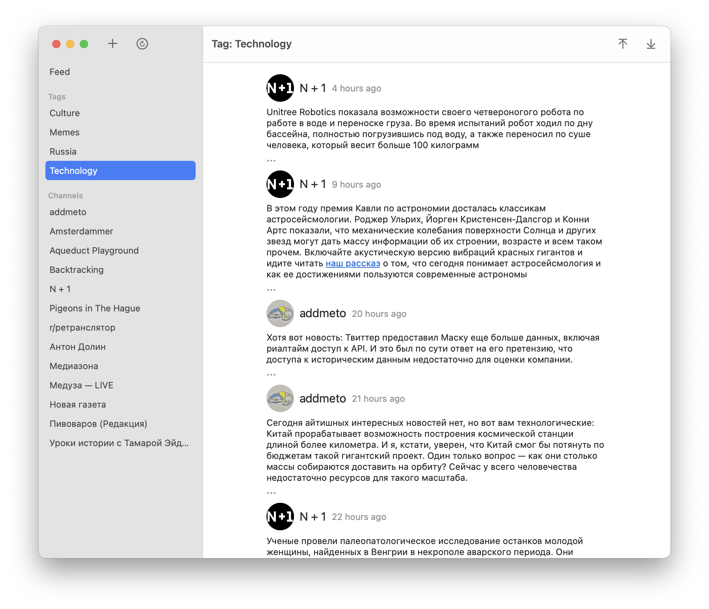

<table>
  <tr>
    <td>
      
    </td>
  </tr>
</table>
  
# Aqueduct

**[Download for macOS 12+](https://github.com/agentcooper/Aqueduct/releases/latest/download/Aqueduct.app.zip)**

Aqueduct is a macOS application to view Telegram channels.

